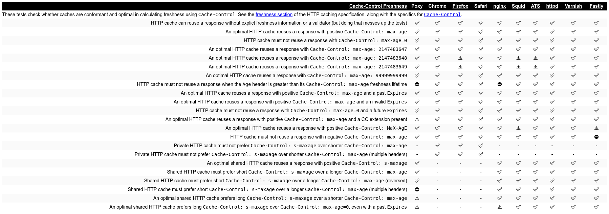
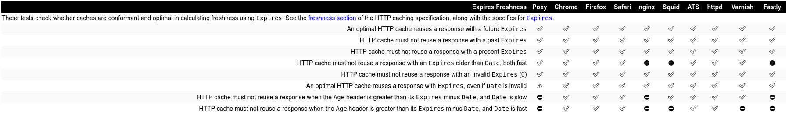
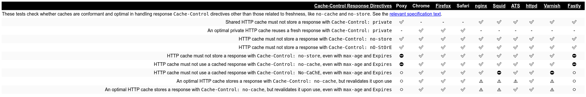
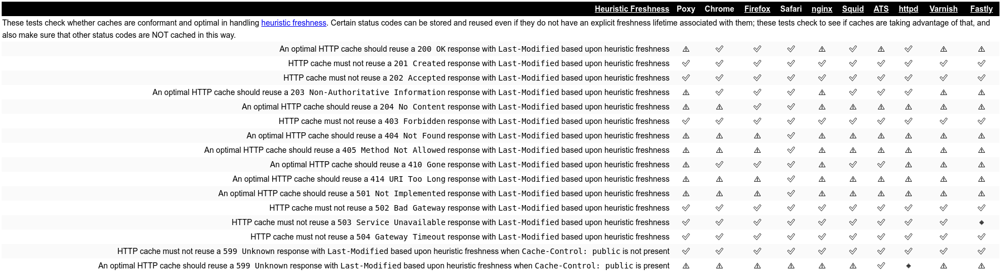
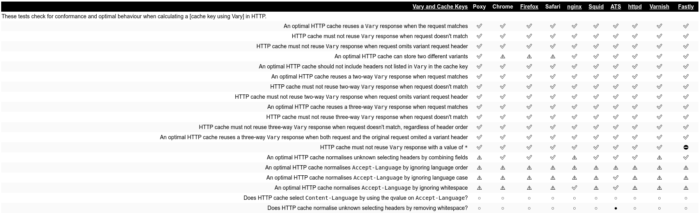

# Introduction
Poxy is a forward proxy server for HTTP(S) and websockets (or anything else that speaks the HTTP `CONNECT` verb), with
limited HTTP caching support (based on [RFC 7234][rfc7234]).

This code is available [on GitHub](https://github.com/devplayer0/poxy).

## Building / running
You'll need [Docker](https://docs.docker.com/install/) and [Docker Compose](https://docs.docker.com/compose/install/).

To run the development server (with hot-reload on code changes), simply do `docker-compose up`. To run a release
version, instead do `docker-compose -f docker-compose.release.yaml up`.

Either way, the proxy will be listening on port 8080 by default. To run `curl` through the proxy for HTTP and HTTPS
requests:

```sh
http_proxy=http://localhost:8080 https_proxy=https://localhost:8080 curl http://example.com
```

# Functionality
All functionality in Poxy is served up by Go's `http.Server`, see `internal/server/server.go`. Code in
`cmd/poxy/main.go` reads command line flags, starts the server and waits for a signal (`SIGINT` or `SIGTERM`) before
shutting down the server.

## HTTP `CONNECT` (for HTTPS / websocket proxying)
If an incoming request uses the `CONNECT` verb, the request is handed off to code in `internal/server/connect.go`.
Proxying a `CONNECT` request is relatively easy: the server need only establish a TCP connection to the backend from the
request URI, issue a `HTTP 200` status line and then pipe all traffic between the client and backend.

This is achieved in Poxy through use of the `http.Hijacker` interface. When a request is received, an attempt is made to
connect to the backend via `net.Dial()`. Upon failure, a `HTTP 502 Bad Gateway` response is issued. Otherwise,
`Hijack()` is called on the `http.ResponseWriter` to obtain the raw TCP `net.Conn` and prevent any further HTTP server
behaviour (since the client will talk pure TCP to the backend via the proxy). Finally, a `HTTP 200` status line is sent
to inform the client that the connection was successful. Data is then piped back and so long as both ends of the
connection remain open.

HTTPS and WebSocket clients will use the `CONNECT` verb when proxying. It is not possible to cache these types of
requests due to the raw stream nature of `CONNECT` sessions (along with the fact that HTTPS requests will obviously be
encrypted an thus opaque to the proxy).

\newpage
## HTTP proxying (with cache)
Incoming requests with a hostname in the request line are treated as forward proxy requests, and are passed to code in
`internal/server/http.go`. Proxying HTTP requests is relatively easy in Go. The process essentially boils down to:

 - Build a new request based on the proxy request (injecting an `X-Forwarded-For` header)
 - Dispatch the request to the backend using a `http.Transport` (_not_ `http.Client` due to its functionality for
 caching connections, handling redirects and cookies - useful functionality in a standalone client but would cause
 issues for a forward proxy)
 - Write the response headers from the backend to the client
 - Pipe the response body to the client's response body writer

However, in order to implement caching (particularly if attempting to adhere to [RFC 7234][rfc7234]), a considerable
amount of functionality is required. Based on this document, there are a few necessary details for caching:

 - Response storage
   - When to store responses
   - Where to store responses
 - Response construction from caches
   - Secondary keys (`Vary` header)
   - Freshness
   - Validation

All but Validation are (mostly) implemented by Poxy.

### Storing responses
#### When to store
When a proxied request is completed (via `Cache.doReq()`), `Cache.Store()` is called to attempt to store the response
in the on-disk cache. Upon receipt of the response, its headers must be checked to see if the cache should actually
store it.

 - Firstly, for simplification, Poxy will only attempt to cache responses to GET requests that returne a `HTTP 200 OK`
 status.
 - If the `Vary` header is set to `*`, the response will never be cached (further information about `Vary` later)
 - If the `no-store` or `private` `Cache-Control` values are present, the response will not be cached
 - Requests containing the `Authorization` header will not be cached _unless_ the `public`, `must-revalidate` or
 `s-maxage` `Cache-Control` values are present

#### Where to store (cache key)
If the above checks pass, the response will be stored in the cache. `Cache.keyedPath()` is used to calculate the cache
key for the response. This key is constructed as the following path:

`<cacheDir>/<md5Host>/<md5URI>/<varyKey>`

 - `cacheDir` is the configured cache directory
 - `md5Host` is a subdirectory whose name is the MD5 hash of the requested `Host` header (thus all cached responses for
 a given host will be within this directory)
 - `md5URI` is a subdirectory of `md5Host` whose name is the MD5 hash of the request line URI (path and query)
 - `varyKey` is a final key calculated for a response based on its `Vary` header

\newpage
#### Vary key
`Cache.keyedPath()` calls `calculateVaryKey()` to obtain `varyKey` based on the value of the `Vary` header. The `Vary`
header's purpose is to distinguish between multiple responses on the same path whose content varies based on certain
request headers. (The header is a comma-space-separated list of these headers).

If no `Vary` header is present in the response, `base` becomes the `varyKey`. Otherwise, a stable key is generated
based on the varied headers and their values. The list of headers is sorted to ensure consistency between responses
where the order of the header names might change. Each header in the sorted list is canonicalised and converted to a
comma-separated list of headers. This forms the left-hand side of the key. The right hand side is an MD5 hash of a
JSON-encoded array of values for the `Vary` headers in the request (in the appropriate order). A sample vary key might
look like:

`Accept-Encoding,User-Agent_d83026283eedf4d5c71a43e5249c1188`

_Note that the left hand side cannot be hashed as this list is parsed later when trying to locate suitable stored
responses_

#### Writing the response out
With the complete response key constructed, the entire response (headers and body) is written out to a file named
`varyKey` in the parent directories as specified. `Cache.Store()` parses the written out response into a new
`http.Response` and transparently replaces the passed response with one whose body to be sent to the client will be read
from the file. If an existing cache entry exists, it is simply overwritten.

### Response construction from cache
When a request comes in, `Cache.Load()` is called to transparently either (a) load a cached response from disk or (b)
forward the request to the backend (and later call `Cache.Store()` to potentially cache the response for future
requests).

#### Finding a cached response
When `Cache.keyedPath()` is called without a value for the `Vary` header (as would be the case for a potentially stored
response to an incoming proxy request), the primary cache key is generated (up to `<cacheDir>/<md5Host>/<md5URI>/`). For
each varied response in the directory, the list of headers is parsed from the left hand side and the `varyKey` for that
set of headers is calculated based on the current request. If the complete `varyKey` matches, that cached response is
added to a list of candidates. If multiple candidates are found, the one with newest modified time is returned. If none
are found, the `base` key is returned.

#### Determining if the stored response should be used
Note that the returned value will always be a valid path but might not actually exist (e.g. if no candidate varied
response was found). `Cache.Load()` will attempt to open the returned path, and if it does not exist will fall back to
calling `Cache.doReq()` to issue the request to the backend.

If the cached response file was opened successfully, a `http.Response` is created via `http.ReadResponse()` on the open
file. If the `Cache-Control` headers in either the request or stored response contain `no-cache` values, the cache is
ignored. Otherwise, the response's freshness and age values are calculated to see if the request is fresh or stale.
Freshness and age are calculated (mostly) [according to RFC 7234](https://tools.ietf.org/html/rfc7234#section-4.2). If
the freshness value is greater than the age, the request's `Response` field will be set to the loaded cache entry and be
sent to the client.

If the stored response is stale, the request will fall through to the backend - validation according to [Section 4.3 of
RFC 7234](https://tools.ietf.org/html/rfc7234#section-4.3) is not implemented.

## Web console
A simple Vue.js-based web console is provided to view request logs and block HTTP requests based on a regex which
matches a request URI. Both HTTP and `CONNECT` proxies trace requests through an info object and push the object to
the browser via server-sent events.

URL blocking is somewhat incomplete: a regex can be submitted through the browser and will be applied to incoming proxy
requests (a REST API endpoint compiles the regex and adds it to a list). However, there is no browser feedback (unless
an error occurs), the list is not persistent and it is not possible to remove rules without restarting the proxy.

\newpage
## Testing
Since the internet runs almost entirely on HTTPS today, HTTP sites to test caching on are few and far between.
https://cache-tests.fyi/ provides a test suite for HTTP caches, ideal for testing Poxy. Some slight modifications were
made to allow for testing a forward proxy (v.s. browser caches and reverse proxies). The modified version is available
at https://github.com/devplayer0/cache-tests.

To perform the tests, follow the steps below:

1. Clone the test repo
2. Install dependencies: `npm install`
3. Start the test server: `npm run server`
4. Start Poxy (ensuring caching is enabled)
5. Execute the tests and save the results:
`http_proxy=http://localhost:8080 npm run --silent cli --base=http://localhost:8000 > results/poxy.json`
6. Open http://localhost:8000 to view results in the browser

### Sample results
Below are some sample test results which show interesting comparisons between other common caches.








[rfc7234]: https://tools.ietf.org/html/rfc7234

\newpage
# Code Listings
## `cmd/poxy/main.go`
```{.go include=report/cmd/poxy/main.go}
```

## `internal/server/connect.go`
```{.go include=report/internal/server/connect.go}
```

## `internal/server/console.go`
```{.go include=report/internal/server/console.go}
```

## `internal/server/http.go`
```{.go include=report/internal/server/http.go}
```

## `internal/server/server.go`
```{.go include=report/internal/server/server.go}
```
